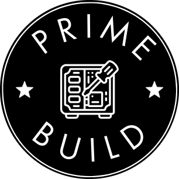

# PrimeBuild PC - Webapp

<div align="center">
  
  <h3>Gaming PC Builder & Service Provider</h3>
</div>

## 📋 Descrizione

PrimeBuild PC è un'azienda specializzata nella costruzione di PC gaming personalizzati di alta qualità, riparazioni e soluzioni di ottimizzazione. Questo repository contiene il sito web ufficiale dell'azienda che mostra i nostri servizi, build personalizzate e componenti.

## 🚀 Caratteristiche

- 💻 Showcase delle build gaming personalizzate
- 🔧 Servizi di riparazione e ottimizzazione
- 🛠️ Componenti di alta qualità
- 📱 Design responsive per tutti i dispositivi
- 🔍 SEO ottimizzato

## 🛠️ Tecnologie

- **Frontend**: React.js, TailwindCSS, Shadcn UI
- **Backend**: Node.js, Express
- **Database**: PostgreSQL (opzionale)
- **Strumenti**: Vite, TypeScript, TanStack Query

## 🚀 Installazione

1. Clona il repository
   ```bash
   git clone https://github.com/PrimeBuild-pc/webapp.git
   cd webapp
   ```

2. Installa le dipendenze
   ```bash
   npm install
   ```

3. Avvia l'applicazione in modalità sviluppo
   ```bash
   npm run dev
   ```

## 📱 Responsive Design

Il sito è completamente responsivo e ottimizzato per:
- Desktop
- Tablet
- Smartphone

## 🤝 Contribuire

Se desideri contribuire al progetto, segui questi passaggi:

1. Forka il repository
2. Crea un branch per la tua feature (`git checkout -b feature/amazing-feature`)
3. Fai commit delle tue modifiche (`git commit -m 'Aggiungi una feature incredibile'`)
4. Pusha al branch (`git push origin feature/amazing-feature`)
5. Apri una Pull Request

## 📜 Licenza

Questo progetto è sotto licenza MIT. Consulta il file `LICENSE` per maggiori informazioni.

## 📞 Contatti

PrimeBuild PC - [primebuild.official@gmail.com](mailto:primebuild.official@gmail.com)

Project Link: [https://github.com/PrimeBuild-pc/webapp](https://github.com/PrimeBuild-pc/webapp)

---

<div align="center">
  <p>© 2025 PrimeBuild PC. Tutti i diritti riservati.</p>
</div>