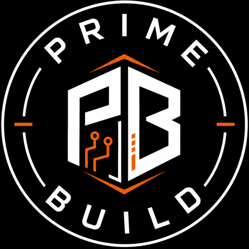

# Prime Build

  

  <h3>PC gaming su misura, assistenza tecnica e ottimizzazione</h3>

  
  
  
  
  
  

## Il progetto

Repository del sito ufficiale di Prime Build, realtà italiana specializzata in PC gaming personalizzati, consulenza hardware, assistenza tecnica e ottimizzazione.

## Contenuti

- Build gaming bilanciate per budget e utilizzo
- Servizi di assemblaggio, assistenza e ottimizzazione
- Guide tecniche su prestazioni, latenza, rete e audio
- Galleria delle configurazioni realizzate
- Modulo di contatto per preventivi
- SEO, dati strutturati e pagine prerenderizzate

## Stack

- React, TypeScript e Vite
- Tailwind CSS e Framer Motion
- Cloudflare Pages e Functions
- GitHub Actions e CodeQL

## Link

- [Sito ufficiale](https://primebuild.website/)
- [Guide tecniche](https://primebuild.website/guides/)
- [Instagram](https://www.instagram.com/prime_build_/)
- [Discord](https://discord.gg/ERUwSxE79q)

## Supporta Prime Build

## Contatti

[preventivi@primebuild.website](mailto:preventivi@primebuild.website)

---

  © 2026 Prime Build. Tutti i diritti riservati.

